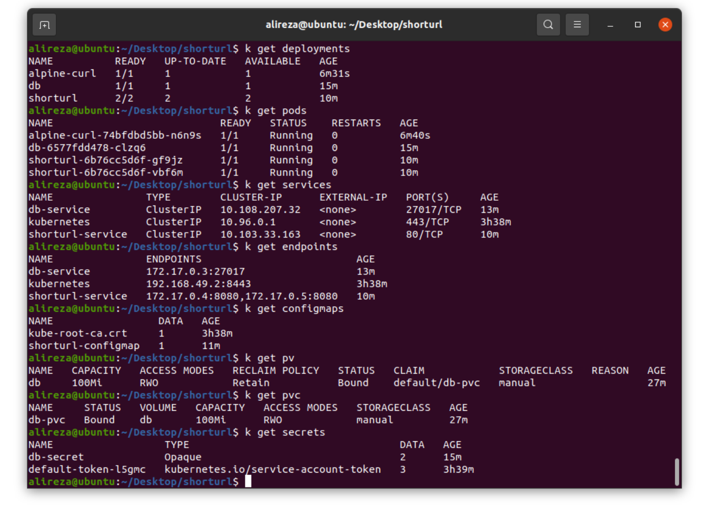

# Distributed URL Shortener with Kubernetes and Docker

 ㅤㅤ

This project is a distributed URL shortener that utilizes Kubernetes and Docker for deployment, along with MongoDB as the database. Unlike traditional URL shorteners implemented with Flask, this project focuses on demonstrating the power and scalability of containerization and orchestration technologies. The environment details after deployment in Kubernetes can be seen in the following picture.

  

## Features
- **Distributed Architecture:** The URL shortener is designed to be distributed across multiple containers, allowing for scalability and fault tolerance.
- **Kubernetes Deployment:** Kubernetes is used to manage the deployment and scaling of the URL shortener containers, ensuring efficient resource utilization.
- **Docker Containers:** Each component of the URL shortener is containerized using Docker, providing encapsulation and portability.
- **MongoDB Database:** The project integrates with MongoDB, a popular NoSQL database, to store and retrieve shortened URLs efficiently.
- **High Availability:** The distributed architecture ensures high availability by replicating the URL shortener containers and managing failover automatically.
- **Load Balancing:** Kubernetes enables load balancing across the URL shortener containers, ensuring optimal distribution of traffic and preventing bottlenecks.

## Prerequisites
- Kubernetes cluster with worker nodes
- Docker installed on each worker node
- MongoDB instance or cluster

## Deployment Instructions
1. Clone this repository to your local machine.
2. Configure the MongoDB connection details in the appropriate configuration files.
3. Build the Docker image for the URL shortener service.
4. Push the Docker image to a container registry accessible by your Kubernetes cluster.
5. Deploy the Kubernetes resources using the provided YAML files, ensuring the correct image and connection details are specified.
6. Monitor the deployment using Kubernetes tools and verify the URL shortener service is running correctly.
7. Test the functionality of the URL shortener by creating and accessing shortened URLs.

## License
This project is licensed under the [MIT License](LICENSE). Feel free to use and modify the code according to your needs.
